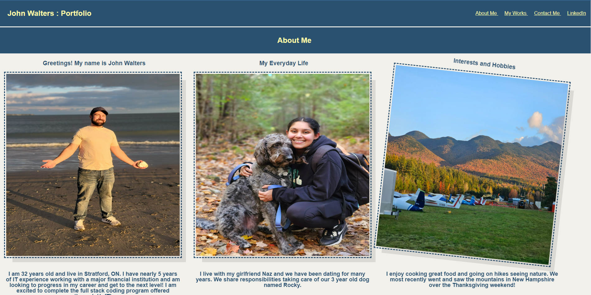

A portfolio of John Walters demonstrating his beginner's HTML and CSS styling abilities. It is a brief overview of works that have been completed in the course thus far. 

There are multiple images with corresponding description and alt tags. There are anchored links allowing for easier navigation and there are overlay effects on photos that interact with the user's mouse when hovered over. 

The codebase follows accessibility standards and is optimized for search engines.

The website's index has incorporated symantic HTML tags and descriptive notations explaining where work was done.

The CSS page has been consolidated and is more legible for people to read and understand.

Overall functionality of links on the page have also been improved.

The webpage meets accessibility standards WHEN you view the source code THEN you find semantic HTML elements.

WHEN you load their portfolio, THEN you am presented with the developer's name, a recent photo or avatar, and links to sections about them, their work, and how to contact them

WHEN you click one of the links in the navigation, THEN the UI scrolls to the corresponding section

WHEN you click on the link to the section about their work, THEN the UI scrolls to a section with titled images of the developer's applications

WHEN you are presented with the developer's first application, THEN that application's image should be larger in size than the others

WHEN you click on the images of the applications, THEN you are taken to that deployed application

WHEN you resize the page or view the site on various screens and devices, THEN you are presented with a responsive layout that adapts to my viewport

Link to website: https://waltscode.github.io/Portfolio/

Screenshot of the site:

